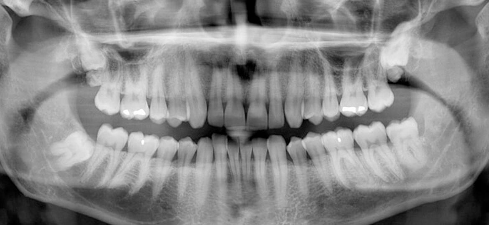

# Malloc-Lusion

Malloc-Lusion is possibly the world's first *Orthodontic Programming Language (OPL)*. Programs are comprised of the relative positions of teeth in the programmer's mouth, as ascertained by panoramic radiograph.

## Language Overview

Malloc-Lusion interprets data as stored in the programmer's mouth. The position of each tooth encodes an instruction. As such, the programmer writes code via conventional orthodontic manipulation of their teeth (albeit in potentially unconventional directions).

Programs are input as a *grayscale* png file of a panoramic radiograph taken of the programmer. The (standardized) deviance of each tooth, read left-right, top-bottom, from the mean dental arch are then used to perform calculations.




Turing completeness is achieved via the standard stack operations.

## Instruction Encoding and Commands

Each instruction is encoded by the location of successive teeth in the programmer's mouth, read left-right, top-bottom on the provided panoramic radiograph. An operand is the absolute standard deviation of a tooth relative to its arch, in units of its height, multiplied by 10.

```
0: Push (multiplying by 100) teeth to the stack until 0 encountered
1: Add top 2 stack items, push result
2: Subtract top of stack from second top, push result
3: Multiply top 2 stack value, push result
4: Divide second top value by top, push result
5: Print top stack value as number
6: Print top stack value as ascii character
7: Jump instruction pointer to top of stack value
8: Print the entire stack as numbers
9: Print the entire stack as a string
10: Drop top stack item
11: Clone top stack item
12: Swap top stack items
13+: Halt
```

Unfortunately we haven't yet managed to find a volunteer for our hello world program.

## Interpreter

The provided interpreter for Malloc-Lusion is written in Python. It uses a neural network (see [RobertSmithers/TeethSegmentation](https://github.com/robertsmithers/teethsegmentation)) to identify the position of each tooth in the input panoramic radiograph. The distances from the mean of each tooth are then used as inputs to a stack-based machine.
